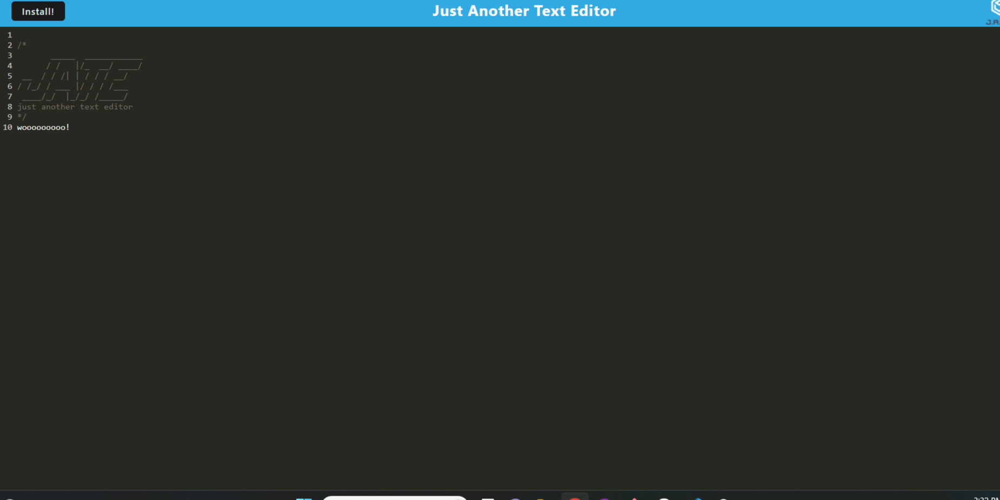

# Text Editor

 

## Description

For our challange this week, we were given the starter code for a text editor webpack and instructed to write its service worker, manifest, and plugins. Working with webpacks was very different from what we've been working with, as well as IndexedDB, which made this one a little more challenging. I can now say that I have experience registering a service worker, writing a manifest, and using workbox recipes.  
  
## Table of Contents
  
[Installation](#Installation)
  
[Usage](#Usage)

[License](#License)
    
[Credits](#Credits)

## Installation

To install the app, you can go to the app [here](https://limitless-basin-88555-4ce549ed990f.herokuapp.com/), and press install at the top of the page

## Usage

When you first access the application, you will see a blank text editor, aside from the header. You can get rid of it if you really want to, but once you start typing code, you will see it start to conform to text-color that a code editor might use. When you click away from the editor, it will be automatically saved to your local storage and the IndexedDB, where it will be loaded and rendered from when you reload the page.

## License

Licensed under the [MIT License](https://opensource.org/licenses/MIT)

## Credits

## Questions

Contact me with any questions:
[Email](#)